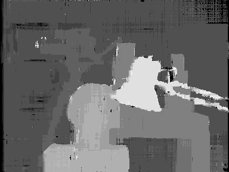

# Semi-Global Matching (4-direction)

> **Repository Moved**  
> This project has been merged into [Semi-Global Matching (SGM-4, SGM-8, SGM-16)](https://github.com/aposb/stereo-matching-using-semi-global-matching).  
> The new repository contains the latest code, documentation, and updates.

A Matlab implementation of Semi-Global Matching (SGM) for stereo matching.
It uses the 4-direction version of the algorithm with a small improvement for better results.
The improvement is that in the calculation of the total cost, the matching cost does not add up. Normally it had to add up four times (once for each direction).

## Input Image
The Tsukuba stereo image that used as input.

   

## Output Image
The disparity map that created at the output.

   

